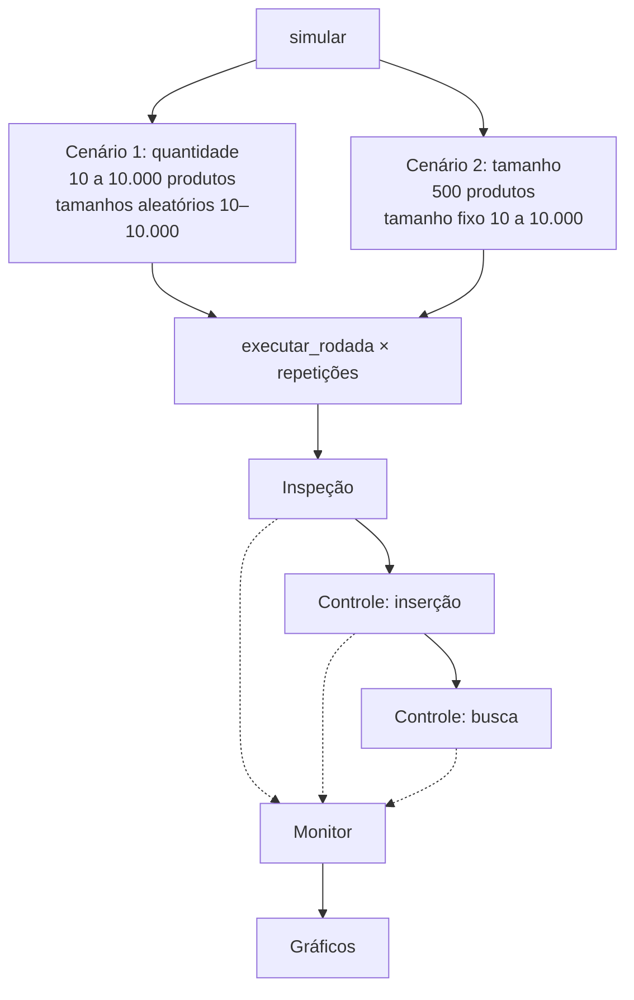

# Arquitetura do sistema (Tarefa 1)

## Fluxo de uma execução

```mermaid
flowchart LR
    G[Gerador / CSV<br>gerador.py] -->|lista de Produto| I[Módulo de Inspeção<br>inspecao.py]
    I -->|calcula tempos<br>tipo 1: O(log n)<br>tipo 2: O(n)| O[Merge sort<br>por tempo]
    O -->|exibe| T[Terminal<br>interface.py]
    O -->|lista ordenada| C[Módulo de Controle<br>controle.py]
    C -->|inserção| H[(Tabela hash<br>m tipos de cliente)]
    Q[Consultas<br>chave, tamanho] --> C
    C -->|busca| R[Tempo de inspeção ou<br>'Produto não encontrado']
    I -. medições .-> M[Monitor<br>monitoramento.py]
    C -. medições .-> M
    M --> P[3 gráficos + medicoes.csv]
```

## Fluxo da simulação



Cada ponto dos gráficos é a média de `--repeticoes` execuções (padrão 3), com
barra de desvio padrão. O coletor de lixo é desativado durante as medições.

## Decisões de projeto

| Decisão | Motivo |
|---|---|
| Inspeções iterativas | A forma recursiva de T(n) = T(n−1) + n estouraria o limite de recursão do Python (1.000) com n = 10.000. |
| Merge sort para ordenar | O(n log n) garantido no pior caso e estável. |
| Tabela hash com encadeamento, h(k) = k mod m | Modela os "m tipos de cliente" com m < k; inserção e busca em O(1 + α). |
| m primo, próximo de n/4 e menor que k | Primos espalham melhor as chaves no método da divisão; α ≈ 4 mantém as listas curtas. |
| Dois cenários de simulação | Separa o efeito da quantidade de produtos (crescimento linear) do efeito do tamanho (log n vs. n). |

## Interpretação dos tempos de inspeção

- **Tipo 1**: 1 h para cada tamanho n, ⌊n/2⌋, ⌊n/4⌋, …, 1 → T(n) = ⌊log₂ n⌋ + 1 horas.
  Leitura adotada: a "preparação" é a hora gasta no tamanho n e "metadata" é
  entendida como "metade". Se a preparação for uma hora extra, basta somar 1
  em `inspecao_tipo1`.
- **Tipo 2**: n + (n−1) + … + 1 = n(n+1)/2 horas. O algoritmo percorre n passos,
  então o custo computacional é O(n), enquanto o tempo simulado cresce em Θ(n²).
  O gráfico do tipo 2 mostra as duas curvas.
